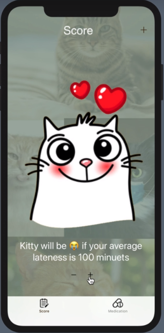
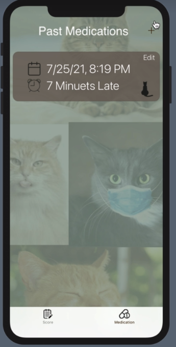
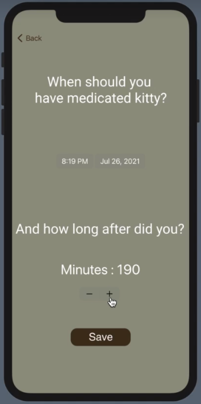
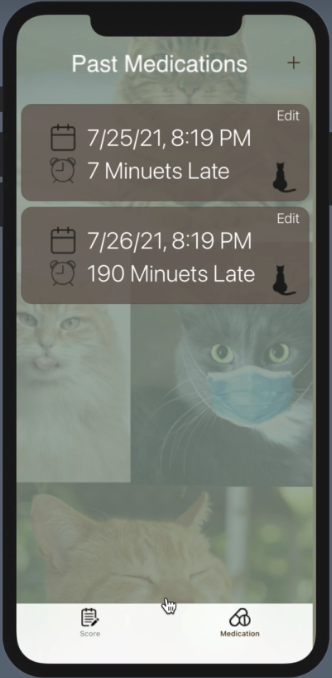
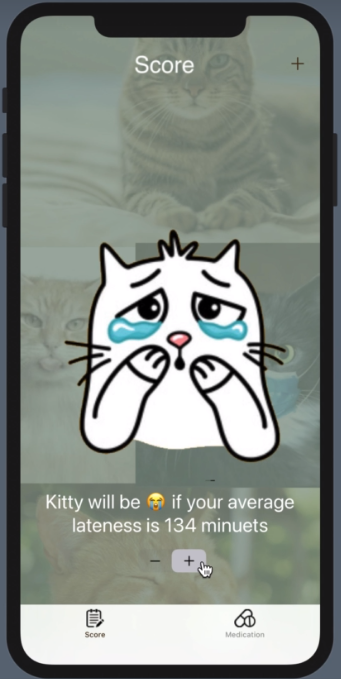

# MediKitty
This mobile application built in SwiftUI is designed to help you medicate your cat faster.

## If you medicate your kitty it will be happy 

## Add when you medicated your kitty

## Let MediKitty how late you were

## If you added and you were late

## Kitty will get sad 😭 

